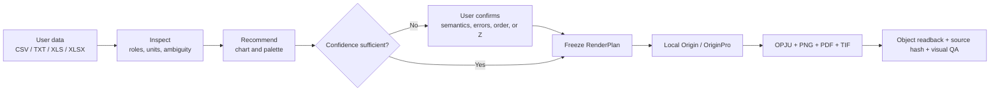
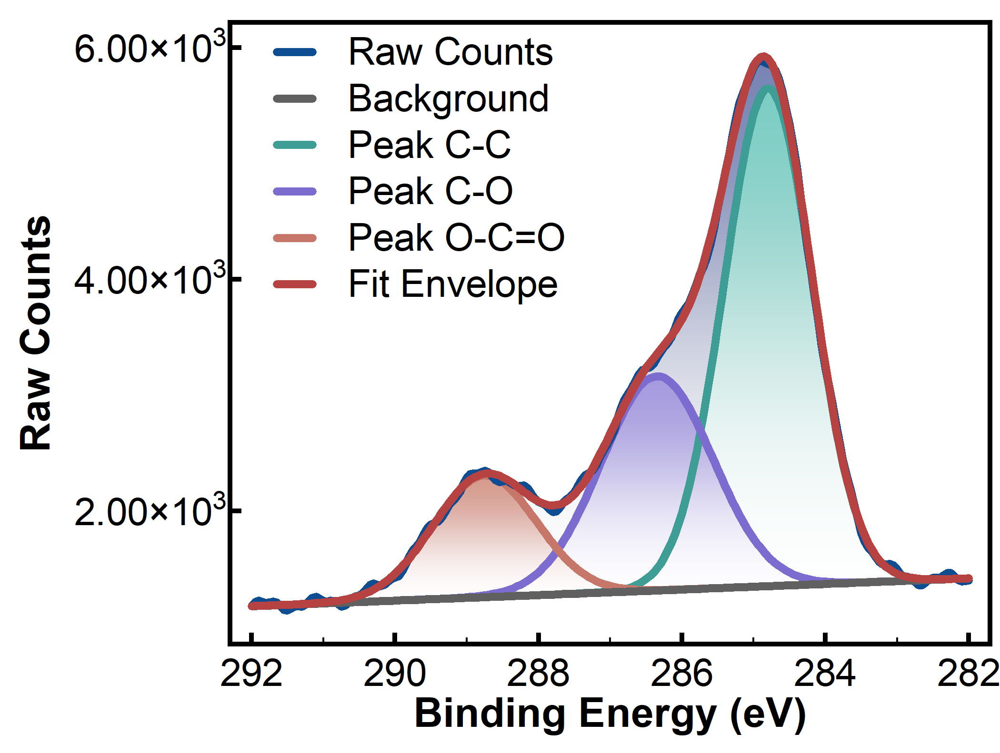
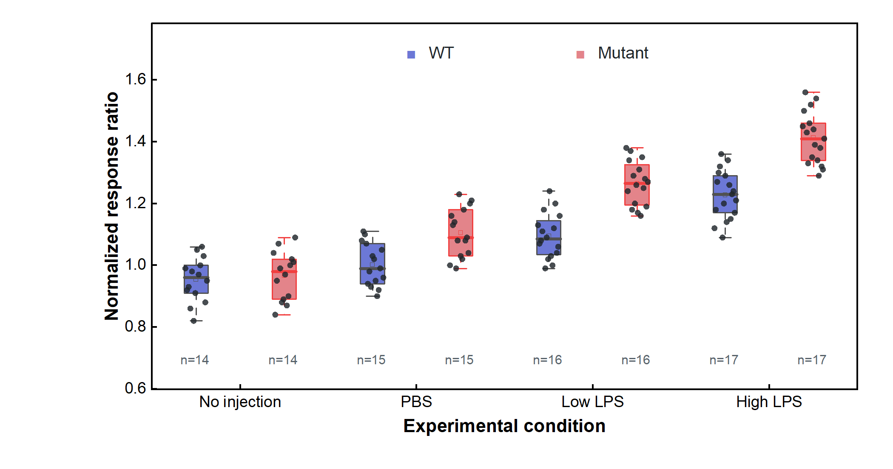
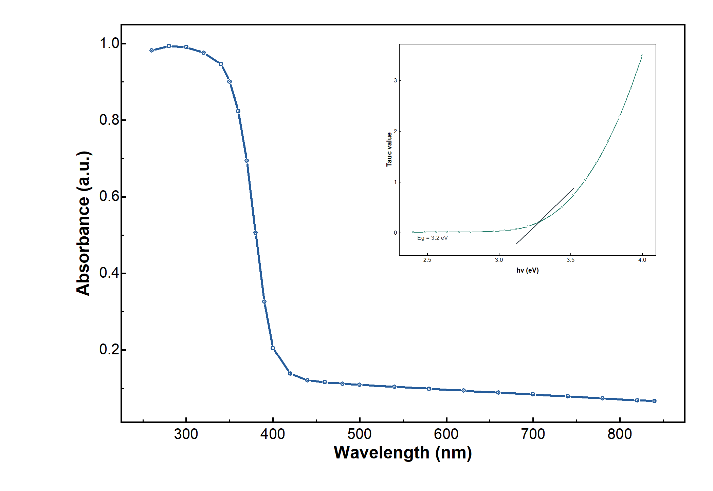
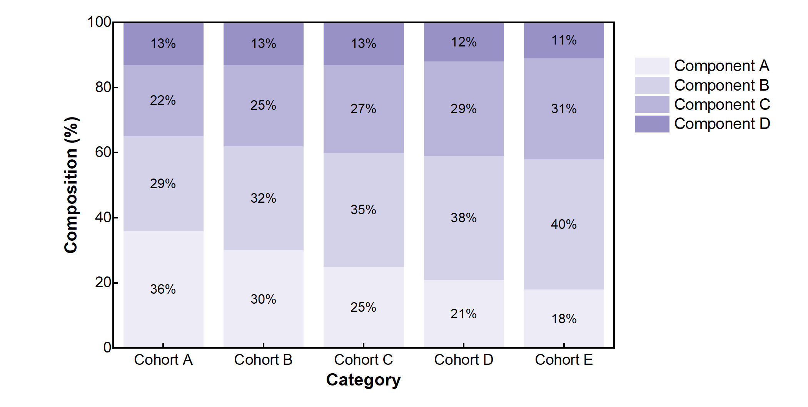
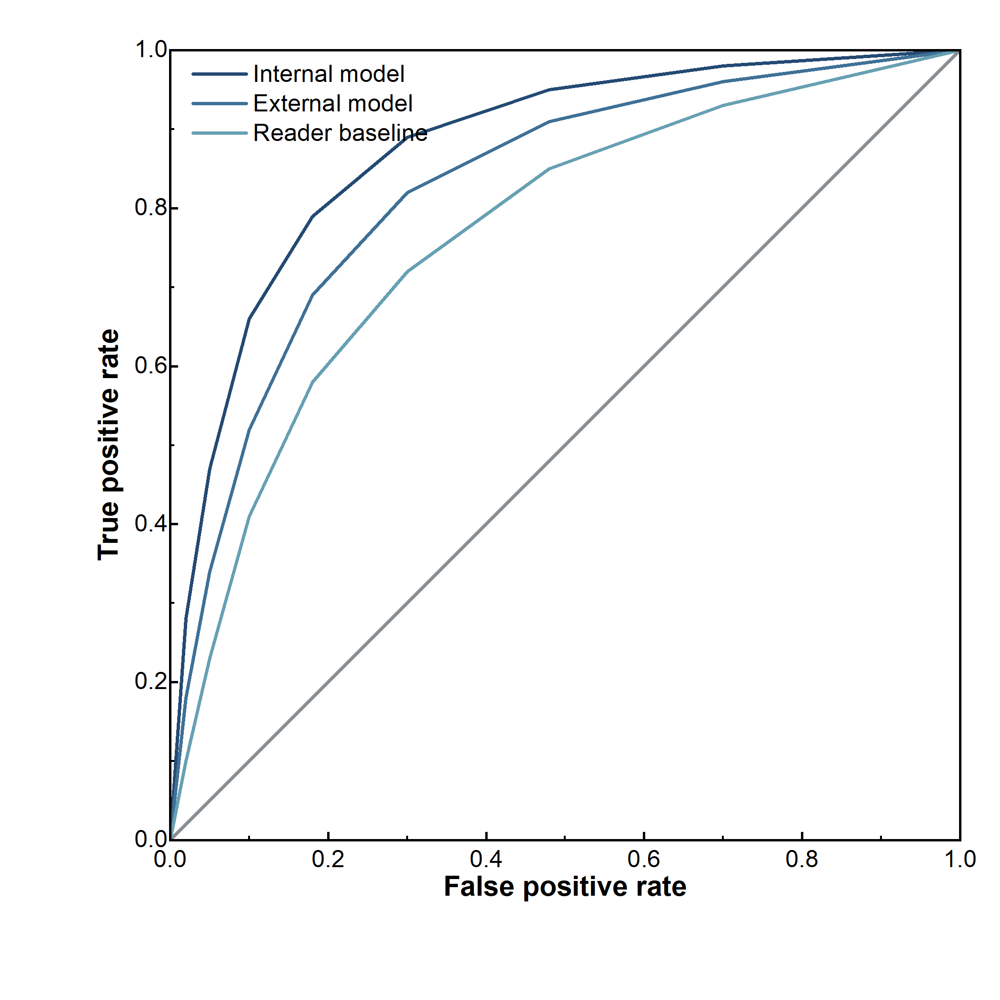
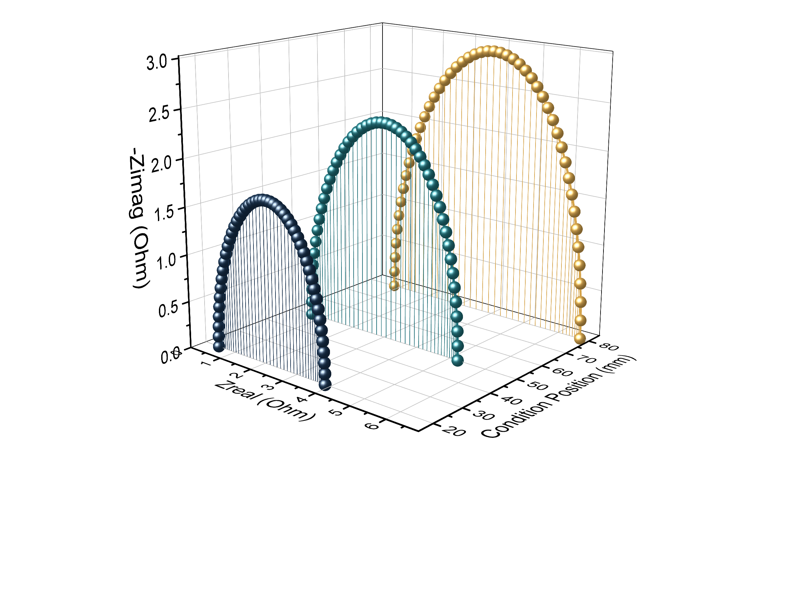

<div align="center">
  
  <h1>EditaPlot</h1>
  <p><strong>AI-guided editable scientific figures</strong><br>AI 驱动的可编辑科研绘图工作流</p>
  <p>
    
    
    
    
    
  </p>
  <p><a href="README.md">中文说明</a> · Chinese is the primary documentation language</p>
</div>

EditaPlot is a local Windows Codex Skill that connects data inspection, chart selection, a frozen plotting contract, local Origin automation, and result verification. It turns a user's own experimental data into an **editable OPJU** plus PNG, PDF, and TIF exports.

It is not a collection of bitmaps or rigid “replace the numbers” templates, and it does not pass a Python-rendered image off as an Origin result. The user retains control of scientific meaning and final choices; ambiguous inputs require confirmation instead of invented columns, fits, or conclusions.

> [!IMPORTANT]
> EditaPlot is open source under the [Apache License 2.0](LICENSE). Rendering requires a separately obtained, legally licensed Origin/OriginPro installation that the user can start manually. Origin, licenses, patches, and activation bypasses are not included.

## Workflow at a glance



A successful job is more than a visible PNG: it requires an editable project, all four outputs, an unchanged source hash, axis/font/layer/object readback, and human visual inspection.

## Coverage

| Domain | Implemented figure and evidence families |
|---|---|
| Materials and spectra | XPS, XRD, XAS, PL/TRPL, UV–Vis/Tauc, EIS, CV, LSV, multi-condition 3D Nyquist |
| General statistics | bars, horizontal bars, error bars, stacked/percentage composition, pie, Sankey, line, trend, scatter, bubble, radar, heatmap |
| Distributions and effects | raw summaries, box, violin, Raincloud, histogram, forest plot |
| Medical and deep learning | ROC, PR, calibration, DCA, confusion matrix, Bland–Altman, paired longitudinal trajectories, grouped boxes, precomputed SHAP, medical panel planning |

The drawing layer never silently smooths, fits, removes outliers, invents peaks, derives error bars, identifies phases, trains a model, invokes SHAP, or computes lifetime/band gap. It draws such evidence only when explicitly supplied.

## Origin-rendered examples

These examples use neutral synthetic teaching data. They were rendered and reviewed with Origin/OriginPro 2024b (10.15); public PNG metadata is sanitized and every file is hash-locked in a manifest.

<div align="center">
  
  
  
  
  
  
</div>

➡️ [Browse all 37 reviewed examples](docs/gallery.md)

## Scientific palettes


Eight launch palettes and two advanced palettes are machine-readable. A confirmed `palette_id` freezes exact HEX values, allowed modes, safe category count, and accessibility warnings into the RenderPlan. Semantic colors for XPS components, signed effects, heatmaps, diagnostic lines, and confusion matrices cannot be overwritten by a cosmetic preference.

The palettes are original abstractions and redraws. Reference covers, watermarks, and layouts are not redistributed, and no official journal endorsement is claimed. See the [palette guide](docs/palette-guide.md).

## Quick start

### Requirements

| Item | Requirement |
|---|---|
| OS | Windows 10/11 |
| Origin | Legally installed and activated by the user, with manual startup confirmed |
| Testing baseline | Origin/OriginPro 2024b (10.15); compatibility target is 2021+ |
| Python | 3.10+ |
| Input | CSV, TXT, XLS, or XLSX; Chinese headers and paths are supported |

`doctor --repair` creates only a project-local `.editaplot-venv` and installs the locked Python dependency allowlist. It never installs, modifies, activates, or launches Origin.

### Install the Codex Skill

```powershell
git clone https://github.com/hang-jin/editaplot.git
Set-Location editaplot
New-Item -ItemType Directory -Force "$HOME\.codex\skills" | Out-Null
Copy-Item -Recurse -Force "skill\editaplot" "$HOME\.codex\skills\editaplot"
```

Open a new Codex task and invoke `$editaplot`, or use the deterministic CLI:

```powershell
python skill/editaplot/scripts/editaplot.py doctor
python skill/editaplot/scripts/editaplot.py inspect <data.csv>
python skill/editaplot/scripts/editaplot.py recommend <data.csv> --intent "compare models with uncertainty"
python skill/editaplot/scripts/editaplot.py palettes
python skill/editaplot/scripts/editaplot.py plan <data.csv> --template-id bar --claim "Model A performs better" --evidence-role comparison --palette-id ocean_coral --output render-plan.json
python skill/editaplot/scripts/editaplot.py render render-plan.json --confirm-origin-started
python skill/editaplot/scripts/editaplot.py verify <Origin-output-directory>
```

The repository contains a cleaned, self-contained `runtime/`. Only engine developers need the optional `--engine-home <engine-root>` override.

### Prompt for Codex

```text
Use $editaplot. Check the local environment first. Repair only project-level Python dependencies;
do not install or modify Origin. Inspect my selected data read-only, explain column roles, units, and
ambiguity, then recommend at most three charts and show the Chinese palette selector. Ask before
proceeding when confidence is low. After confirmation, freeze the RenderPlan without changing my data.
I will authorize rendering only after I have manually started Origin.
```

## Public repository vs local private evidence

The public repository is complete, runnable software. The local private layer contains only evidence that should not travel with a source release; it is not a hidden feature set or paid edition.

| Included in the public repository | Kept only on the developer's or user's machine |
|---|---|
| Apache-2.0 source, complete Skill, sanitized runtime | `DEVELOPMENT_LEDGER.md`, internal plans, development logs |
| Neutral synthetic examples and original palette assets | User data, reference screenshots, material without redistribution rights |
| 37 reviewed, metadata-sanitized PNG examples | OPJU/PDF/TIF, RenderPlans, readback and verification JSON |
| Bilingual docs, tests, dependency locks, asset/runtime manifests | Absolute paths, caches, virtual environments, temporary outputs, secrets and tokens |

A default-deny allowlist, extension/size rules, path and secret scanning, PNG structure/metadata checks, provenance records, and SHA-256 manifests protect the public boundary. See [release and licensing boundaries](docs/release-boundaries.md).

## Scientific and safety boundaries

- Original files are read-only; helper columns live only in memory or the editable Origin workbook.
- Missing data produces repair guidance, never fabricated measurements.
- 3D is used only when the third axis has real experimental meaning and improves the evidence.
- A movable legend is acceptable; missing axes, inconsistent fonts, overlapping colorbars, and clipped text are failures.
- New Origin APIs require official documentation and an isolated experiment before entering a template.

## Independent project notice

EditaPlot requires a separately obtained, locally installed, validly licensed copy of Origin or OriginPro. It does not bundle, install, activate, patch, or bypass that software, and it does not expose the Automation Server over a network or cloud. EditaPlot is not affiliated with, sponsored by, or endorsed by OriginLab Corporation; names are used only to describe compatibility.

## Open source, contributing, and support

- License: [Apache License 2.0](LICENSE)
- Installation and troubleshooting: [docs/installation.md](docs/installation.md)
- English quick start: [docs/quickstart.en.md](docs/quickstart.en.md)
- Contributing: [CONTRIBUTING.md](CONTRIBUTING.md)
- Security reports: [SECURITY.md](SECURITY.md)
- Support scope: [SUPPORT.md](SUPPORT.md)
- Dependencies and licenses: [docs/dependency-inventory.md](docs/dependency-inventory.md)

The maintainer may separately offer consulting, installation help, customization, or support without restricting Apache-2.0 rights. Paid software licensing, hosted or multi-tenant operation, remote automation, or third-party trademarks in product branding require a fresh licensing and trademark review.
