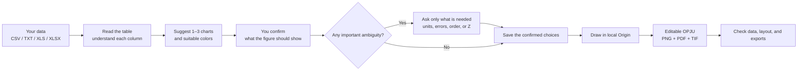

<div align="center">
  
  <h1>EditaPlot</h1>
  <p><strong>AI-guided editable scientific figures</strong><br>AI 驱动的可编辑科研绘图工作流</p>
  <p>
    
    
    
    
    
    <a href="https://github.com/hang-jin/editaplot"></a>
  </p>
  <p><a href="README.md">中文说明</a> · Chinese is the primary documentation language</p>
</div>

I built EditaPlot as a local Windows Codex Skill for turning your experimental data into an **editable OPJU** plus PNG, PDF, and TIF exports. It guides the job from data inspection and chart selection through a frozen plotting contract, local Origin automation, and result verification.

I did not want this to become a collection of rigid “replace the numbers” templates, and a Python preview is never passed off as an Origin result. You keep control of the scientific meaning and final choices. When the input is ambiguous, EditaPlot asks you before drawing instead of inventing columns, fits, or conclusions.

> [!WARNING]
> **I have completed full validation only on physical Windows 10/11 x64 computers.** V1 therefore does not yet provide a macOS (Intel or Apple Silicon), Linux, WSL, Wine/CrossOver, Parallels, or other virtual-machine version. If you use a Mac, this release cannot complete the Origin workflow; use a physical Windows computer and check future release notes for platform updates.

> [!IMPORTANT]
> I release EditaPlot under the [Apache License 2.0](LICENSE). To render a figure, your computer needs an existing Origin/OriginPro installation that can be reached through Automation. I do not install or modify Origin.

## Workflow at a glance



When I say a figure is finished, you receive an editable Origin project plus PNG, PDF, and TIF files. I also check that the source data is unchanged, labels are complete, and every file opens correctly.

## Star trend

I started recording the repository's aggregate GitHub Star count on launch day. The first snapshot is a truthful 31-Star starting point; later daily snapshots will form the line naturally.

<div align="center">
  <a href="https://github.com/hang-jin/editaplot"></a>
</div>

I store only the date and aggregate repository count. I do not read or store usernames, account IDs, personal star timestamps, or Stargazer lists.

## Coverage

| Domain | Implemented figure and evidence families |
|---|---|
| Materials and spectra | XPS, XRD, XAS, PL/TRPL, UV–Vis/Tauc, EIS, CV, LSV, multi-condition 3D Nyquist |
| General statistics | bars, horizontal bars, error bars, stacked/percentage composition, pie, Sankey, line, trend, scatter, bubble, radar, heatmap |
| Distributions and effects | raw summaries, box, violin, Raincloud, histogram, forest plot |
| Medical and deep learning | ROC, PR, calibration, DCA, confusion matrix, Bland–Altman, paired longitudinal trajectories, grouped boxes, precomputed SHAP, medical panel planning |

I do not silently smooth data, remove outliers, invent peaks, derive error bars, fit curves, identify phases, or train models. Lifetime, band-gap, SHAP, and similar analysis results are drawn only when you explicitly provide them.

## Origin-rendered examples

I made and manually checked these examples with synthetic teaching data. Metadata that could expose local information has been removed, and every public image checksum is recorded in a manifest.

<div align="center">
  
  
  
  
  
  
</div>

➡️ [Browse all 37 reviewed examples](docs/gallery.md)

## Scientific palettes


I provide eight beginner-friendly launch palettes and two advanced palettes. You only need to choose a palette; EditaPlot remembers the exact colors and limits so future redraws stay consistent. I do not change scientifically meaningful colors for XPS components, signed values, heatmaps, or diagnostic lines merely for decoration.

I created these palettes as original abstractions and redraws. They do not copy journal covers, watermarks, or layouts, and they are not official journal templates. See the [palette guide](docs/palette-guide.md).

## Quick start

### Requirements

| Item | What you need to know |
|---|---|
| OS | I have fully validated physical Windows 10/11 x64 computers; Mac, Linux, WSL, and VM versions are not available yet |
| Origin | Your computer needs Origin/OriginPro and must allow EditaPlot to connect; I have fully validated 2024b (10.15) |
| Python | You need 64-bit Python 3.10–3.12; the launcher selects it automatically, so no manual setup is needed |
| Input | You can use CSV, TXT, XLS, or XLSX, including Chinese headers and paths |

You do not need to solve the Python environment first. I designed the root `editaplot.cmd` to find a compatible Python already on your computer and create an environment used only by this project. If none is available, it explains the change and waits for your consent before using official winget to install user-scope Python 3.12; without winget, it gives you the official python.org instructions. This setup does not install or modify Origin. The local connection is tested only when rendering begins.

### Install the Codex Skill

```powershell
git clone https://github.com/hang-jin/editaplot.git
Set-Location editaplot
.\editaplot.cmd setup
```

Please keep the complete repository because `skill/editaplot` and the rendering `runtime/` work together. Copying only the Skill folder leaves the drawing engine behind. If GitHub is new to you, simply download the repository's Source ZIP, extract the whole archive, and run the same `setup` command in that folder. See the [installation guide](docs/installation.md).

Open a new Codex task and invoke `$editaplot`. For a first dataset, run:

```powershell
.\editaplot.cmd start "$HOME\Documents\my-data.csv"
```

If this is your first run, the easiest route is to attach the file in Codex and say, “Use `$editaplot` to make the right figure from this data.” I designed EditaPlot to handle the environment check, read-only inspection, and chart suggestions. You confirm one sentence describing the scientific purpose; only unclear cases need a few extra details about roles, errors, or transformations. When you are comfortable with the command line, these commands are also available:

When rendering begins, I have EditaPlot create a `<source_stem>_EditaPlot_<time>` folder directly beside your original data. The approved render plan, OPJU, PNG, PDF, TIF, readback, and verification files stay together there. Your source file is never overwritten, and the destination changes only when you explicitly request another location.

```powershell
.\editaplot.cmd doctor
.\editaplot.cmd inspect <data.csv>
.\editaplot.cmd recommend <data.csv> --intent "compare models with uncertainty"
.\editaplot.cmd palettes
.\editaplot.cmd plan <data.csv> --template-id bar --claim "Model A performs better" --evidence-role comparison --palette-id ocean_coral --output render-plan.json
.\editaplot.cmd render render-plan.json
.\editaplot.cmd verify <Origin-output-directory>
```

The repository already contains the required `runtime/`. You can ignore `--engine-home` in normal use; it is needed only when you intentionally replace the built-in engine.

### Prompt for Codex

```text
Use $editaplot to draw this data. Do not modify the source file. First tell me which columns you
recognized, which chart you recommend, and what I still need to confirm. Ask before installing Python;
do not install or modify Origin. Draw only after I confirm the scientific purpose, then check the
editable project and PNG, PDF, and TIF files. If doctor finds Origin, test the connection while rendering.
```

## What I publish and what stays local

I keep the public repository complete and runnable. To avoid mixing private data and development records into a source release, I retain only non-release evidence locally; there is no hidden feature set or “paid complete edition.”

| What I include in the public repository | What stays only on a local machine |
|---|---|
| Apache-2.0 source, complete Skill, sanitized runtime | `DEVELOPMENT_LEDGER.md`, internal plans, development logs |
| Neutral synthetic examples and original palette assets | Your original data, reference screenshots, material without redistribution rights |
| 37 reviewed, metadata-sanitized PNG examples | OPJU/PDF/TIF, RenderPlans, readback and verification JSON |
| Bilingual docs, tests, dependency locks, asset/runtime manifests | Absolute paths, caches, virtual environments, temporary outputs, secrets and tokens |

To avoid publishing local material by mistake, I use an allowlist, secret scanning, PNG checks, and SHA-256 manifests. See [release and licensing boundaries](docs/release-boundaries.md).

## Boundaries I keep for scientific reliability

- I keep original files read-only; drawing-only helper columns live only in memory or the editable Origin workbook.
- When columns are missing, I explain how to repair the table instead of fabricating measurements.
- I use 3D only when the third axis has real experimental meaning and improves the evidence.
- A legend may be moved later in OPJU, but missing axes, inconsistent fonts, overlapping colorbars, and clipped text still count as failures.
- I review official documentation and run an isolated experiment before adding a new Origin API to a template.

## Independent project notice

I maintain EditaPlot independently. It calls an Origin or OriginPro application that already exists on your computer; it does not bundle, install, or modify that application, and it does not expose the Automation Server over a network or cloud. I am not affiliated with, sponsored by, or endorsed by OriginLab Corporation; names are used only to describe compatibility.

## Open source, contributing, and support

The badge and trend chart use only GitHub's aggregate repository count. I do not request, store, or display Stargazer lists, usernames, account IDs, or personal star timestamps.

- License: [Apache License 2.0](LICENSE)
- Installation and troubleshooting: [docs/installation.md](docs/installation.md)
- English quick start: [docs/quickstart.en.md](docs/quickstart.en.md)
- Contributing: [CONTRIBUTING.md](CONTRIBUTING.md)
- Security reports: [SECURITY.md](SECURITY.md)
- Support scope: [SUPPORT.md](SUPPORT.md)
- Dependencies and licenses: [docs/dependency-inventory.md](docs/dependency-inventory.md)

I may later offer consulting, installation help, customization, or support, but that will not restrict the rights already granted by Apache-2.0. Before any future paid software licensing, hosted or multi-tenant service, or remote automation release, I will complete a fresh licensing and trademark review.
