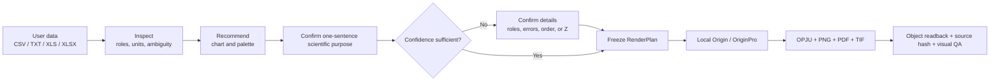

<div align="center">
  
  <h1>EditaPlot</h1>
  <p><strong>AI-guided editable scientific figures</strong><br>AI 驱动的可编辑科研绘图工作流</p>
  <p>
    
    
    
    
    
  </p>
  <p><a href="README.md">中文说明</a> · Chinese is the primary documentation language</p>
</div>

EditaPlot is a local Windows Codex Skill that connects data inspection, chart selection, a frozen plotting contract, local Origin automation, and result verification. It turns a user's own experimental data into an **editable OPJU** plus PNG, PDF, and TIF exports.

It is not a collection of bitmaps or rigid “replace the numbers” templates, and it does not pass a Python-rendered image off as an Origin result. The user retains control of scientific meaning and final choices; ambiguous inputs require confirmation instead of invented columns, fits, or conclusions.

> [!WARNING]
> **V1 supports only physical Windows 10/11 x64 computers.** macOS (Intel and Apple Silicon), Linux, WSL, Wine/CrossOver, Parallels, and other virtual machines are unsupported. Do not follow the Windows setup on a Mac: this release cannot automate Origin from macOS.

> [!IMPORTANT]
> EditaPlot is open source under the [Apache License 2.0](LICENSE). Rendering requires a separately obtained, legally licensed Origin/OriginPro installation that the user can start manually. Origin, licenses, patches, and activation bypasses are not included.

## Workflow at a glance



A successful job is more than a visible PNG: it requires an editable project, all four outputs, an unchanged source hash, axis/font/layer/object readback, and human visual inspection.

## Coverage

| Domain | Implemented figure and evidence families |
|---|---|
| Materials and spectra | XPS, XRD, XAS, PL/TRPL, UV–Vis/Tauc, EIS, CV, LSV, multi-condition 3D Nyquist |
| General statistics | bars, horizontal bars, error bars, stacked/percentage composition, pie, Sankey, line, trend, scatter, bubble, radar, heatmap |
| Distributions and effects | raw summaries, box, violin, Raincloud, histogram, forest plot |
| Medical and deep learning | ROC, PR, calibration, DCA, confusion matrix, Bland–Altman, paired longitudinal trajectories, grouped boxes, precomputed SHAP, medical panel planning |

The drawing layer never silently smooths, fits, removes outliers, invents peaks, derives error bars, identifies phases, trains a model, invokes SHAP, or computes lifetime/band gap. It draws such evidence only when explicitly supplied.

## Origin-rendered examples

These examples use neutral synthetic teaching data. They were rendered and reviewed with Origin/OriginPro 2024b (10.15); public PNG metadata is sanitized and every file is hash-locked in a manifest.

<div align="center">
  
  
  
  
  
  
</div>

➡️ [Browse all 37 reviewed examples](docs/gallery.md)

## Scientific palettes


Eight launch palettes and two advanced palettes are machine-readable. A confirmed `palette_id` freezes exact HEX values, allowed modes, safe category count, and accessibility warnings into the RenderPlan. Semantic colors for XPS components, signed effects, heatmaps, diagnostic lines, and confusion matrices cannot be overwritten by a cosmetic preference.

The palettes are original abstractions and redraws. Reference covers, watermarks, and layouts are not redistributed, and no official journal endorsement is claimed. See the [palette guide](docs/palette-guide.md).

## Quick start

### Requirements

| Item | Requirement |
|---|---|
| OS | Physical Windows 10/11 x64 computer; no macOS, Linux, WSL, or VM support |
| Origin | Legally installed and activated by the user, with manual startup confirmed |
| Origin verification | Verified on Origin/OriginPro 2024b (10.15); every other version requires separate verification |
| Python | CLI/dependencies are covered on 64-bit CPython 3.10–3.12; the live Origin end-to-end baseline is CPython 3.10 + Origin 2024b |
| Input | CSV, TXT, XLS, or XLSX; Chinese headers and paths are supported |

The root `editaplot.cmd` prefers a compatible Python already on the computer, then creates a project-local `.editaplot-venv` with locked dependencies. If no compatible Python exists, the Skill must explain the system-level change and obtain explicit consent before using official winget to install Python 3.12 in user scope; without winget it provides the official python.org instructions. It never changes the system silently and never installs, modifies, activates, or launches Origin.

### Install the Codex Skill

```powershell
git clone https://github.com/hang-jin/editaplot.git
Set-Location editaplot
.\editaplot.cmd setup
```

Keep the complete repository. **Do not copy only `skill/editaplot`**: the rendering runtime would be missing and the result is `engine_not_found`. No GitHub experience or account is required—download the repository's Source ZIP, extract the whole archive, and run the same `setup` command in that folder. See the [installation guide](docs/installation.md).

Open a new Codex task and invoke `$editaplot`. For a first dataset, run:

```powershell
.\editaplot.cmd start "$HOME\Documents\my-data.csv"
```

Or simply attach the file in Codex and say, “Use `$editaplot` to make the right figure from this data.” The Skill handles environment checks, read-only inspection, and chart suggestions behind the scenes. It always asks you to confirm a one-sentence scientific purpose; low-confidence cases add only the focused questions needed about roles, errors, or transformations. Advanced users can still use the deterministic commands:

```powershell
.\editaplot.cmd doctor
.\editaplot.cmd inspect <data.csv>
.\editaplot.cmd recommend <data.csv> --intent "compare models with uncertainty"
.\editaplot.cmd palettes
.\editaplot.cmd plan <data.csv> --template-id bar --claim "Model A performs better" --evidence-role comparison --palette-id ocean_coral --output render-plan.json
.\editaplot.cmd render render-plan.json --confirm-origin-started
.\editaplot.cmd verify <Origin-output-directory>
```

The repository contains a cleaned, self-contained `runtime/`. Only engine developers need the optional `--engine-home <engine-root>` override.

### Prompt for Codex

```text
Use $editaplot. Check the local environment and reuse a compatible Python first. If none exists,
explain that official Python 3.12 installation is a system-level change and wait for my explicit consent.
Keep Python packages project-local; do not install or modify Origin. Inspect my selected data read-only, explain column roles, units, and
ambiguity, then recommend at most three charts and show the Chinese palette selector. Ask me to
confirm a one-sentence scientific purpose; when confidence is low, ask the additional focused questions
needed. After confirmation, freeze the RenderPlan without changing my data.
I will authorize rendering only after I have manually started Origin.
```

## Public repository vs local private evidence

The public repository is complete, runnable software. The local private layer contains only evidence that should not travel with a source release; it is not a hidden feature set or paid edition.

| Included in the public repository | Kept only on the developer's or user's machine |
|---|---|
| Apache-2.0 source, complete Skill, sanitized runtime | `DEVELOPMENT_LEDGER.md`, internal plans, development logs |
| Neutral synthetic examples and original palette assets | User data, reference screenshots, material without redistribution rights |
| 37 reviewed, metadata-sanitized PNG examples | OPJU/PDF/TIF, RenderPlans, readback and verification JSON |
| Bilingual docs, tests, dependency locks, asset/runtime manifests | Absolute paths, caches, virtual environments, temporary outputs, secrets and tokens |

A default-deny allowlist, extension/size rules, path and secret scanning, PNG structure/metadata checks, provenance records, and SHA-256 manifests protect the public boundary. See [release and licensing boundaries](docs/release-boundaries.md).

## Scientific and safety boundaries

- Original files are read-only; helper columns live only in memory or the editable Origin workbook.
- Missing data produces repair guidance, never fabricated measurements.
- 3D is used only when the third axis has real experimental meaning and improves the evidence.
- A movable legend is acceptable; missing axes, inconsistent fonts, overlapping colorbars, and clipped text are failures.
- New Origin APIs require official documentation and an isolated experiment before entering a template.

## Independent project notice

EditaPlot requires a separately obtained, locally installed, validly licensed copy of Origin or OriginPro. It does not bundle, install, activate, patch, or bypass that software, and it does not expose the Automation Server over a network or cloud. EditaPlot is not affiliated with, sponsored by, or endorsed by OriginLab Corporation; names are used only to describe compatibility.

## Open source, contributing, and support

### Star history

<a href="https://github.com/hang-jin/editaplot/stargazers">
  
</a>

GitHub Actions retains an observation whenever the observed Star total changes and publishes it to a separate `metrics` branch. The solid line starts with the first observation and can rise or fall; public star timestamps appear only as dashed context. GitHub exposes neither unstar timestamps nor historical peaks from before collection began. The image appears after the repository's first successful Star History workflow run. Click it to view the current stargazers.

- License: [Apache License 2.0](LICENSE)
- Installation and troubleshooting: [docs/installation.md](docs/installation.md)
- English quick start: [docs/quickstart.en.md](docs/quickstart.en.md)
- Contributing: [CONTRIBUTING.md](CONTRIBUTING.md)
- Security reports: [SECURITY.md](SECURITY.md)
- Support scope: [SUPPORT.md](SUPPORT.md)
- Dependencies and licenses: [docs/dependency-inventory.md](docs/dependency-inventory.md)

The maintainer may separately offer consulting, installation help, customization, or support without restricting Apache-2.0 rights. Paid software licensing, hosted or multi-tenant operation, remote automation, or third-party trademarks in product branding require a fresh licensing and trademark review.
