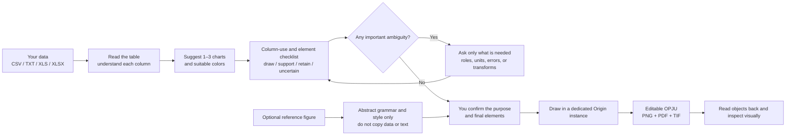
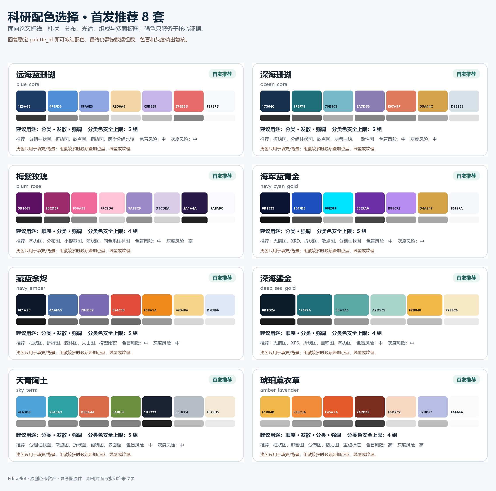

<div align="center">
  
  <h1>EditaPlot</h1>
  <p><strong>AI-guided editable scientific figures</strong><br>AI 驱动的可编辑科研绘图工作流</p>
  <p>
    
    
    
    
    
    
    <a href="https://github.com/hang-jin/editaplot"></a>
  </p>
  <p><a href="README.md">中文说明</a> · Chinese is the primary documentation language</p>
</div>

I built EditaPlot as a local Windows Codex Skill for turning your experimental data into an **editable OPJU** plus PNG, PDF, and TIF exports. It guides the job from data inspection and per-column use classification through chart selection, element confirmation, local Origin automation, and result verification.

I did not want this to become a collection of rigid “replace the numbers” templates, and a Python preview is never passed off as an Origin result. You keep control of the scientific meaning and final choices. When the input is ambiguous, EditaPlot lists the unresolved columns and asks you before drawing instead of inventing columns, fits, or conclusions.

> [!WARNING]
> **I have completed full validation only on physical Windows 10/11 x64 computers.** V1 therefore does not yet provide a macOS (Intel or Apple Silicon), Linux, WSL, Wine/CrossOver, Parallels, or other virtual-machine version. If you use a Mac, this release cannot complete the Origin workflow; use a physical Windows computer and check future release notes for platform updates.

> [!IMPORTANT]
> I release EditaPlot under the [Apache License 2.0](LICENSE). The current compatibility target is Origin/OriginPro 2021–2026b. You do not need to open it first: EditaPlot starts a dedicated instance before rendering. I do not install or modify Origin.

## Workflow at a glance


```mermaid
flowchart LR
    A["Your data<br>CSV / TXT / XLS / XLSX"] --> B["Read the table<br>understand each column"]
    B --> C["Suggest 1–3 charts<br>and suitable colors"]
    C --> D["Column-use and element checklist<br>draw / support / retain / uncertain"]
    D --> E{"Any important ambiguity?"}
    E -- Yes --> F["Ask only what is needed<br>roles, units, errors, or transforms"]
    F --> D
    E -- No --> G["You confirm the purpose<br>and final elements"]
    R["Optional reference figure"] --> S["Abstract grammar and style only<br>do not copy data or text"]
    S --> G
    G --> H["Draw in a dedicated Origin instance"]
    H --> I["Editable OPJU<br>PNG + PDF + TIF"]
    I --> J["Read objects back and inspect visually"]
```

When I say a figure is finished, you receive an editable Origin project plus PNG, PDF, and TIF files. I also check that the source data is unchanged, labels are complete, and every required artifact passes format, object-readback, and human visual checks.

## Understand the data before choosing what to draw

Many scientific tables contain numbers that should not all become visible series. I first place **every source column** in one of these uses and ask you to confirm the result in plain language:

| Use | Treatment in the figure |
|---|---|
| Primary evidence | Drawn as the observed points, main curve, bars, or another central mark |
| Visible supporting evidence | Drawn as a background, fit, residual, reference line, or phase ticks |
| Support or validation only | Retained for weights, filtering, coordinates, or layout, but not drawn as a curve |
| Retain without rendering | Kept in the mapping and editable project without appearing in the figure |
| Uncertain | Planning stops until you clarify the role; it is never guessed into a new series |

The confirmation summarizes the apparent data type, what will and will not be drawn, the proposed figure elements, and calculations that the drawing layer will not perform. A changed source file, mapping, or understanding invalidates that confirmation.

### GSAS / GSAS-II XRD Rietveld example

I added dedicated understanding rules for ordinary XRD and official-style GSAS-II Powder and Publication CSV files. In a refinement table, EditaPlot can treat Observed as points and Calculated as the main line, then add Background, Difference, and explicitly identified Phase ticks only when the file supplies them. Columns such as `weight`, `Q`, `Used`, `diff/sigma`, and `Axis-limits` remain support or control data rather than accidental intensity curves.

A Publication CSV `Diff` that already contains its display position is drawn directly without a second offset. EditaPlot does not calculate a background, difference, Rwp, or χ², and it does not identify phases or assign peaks for you. Start with [`example_gsas_powder.csv`](runtime/templates/xrd/example_gsas_powder.csv) and [`example_gsas_publication.csv`](runtime/templates/xrd/example_gsas_publication.csv) if you want to inspect the accepted structures.

### Use a reference figure as a visual brief

You may also supply a local PNG, JPEG, or TIFF reference. EditaPlot treats it as a visual brief: it abstracts panels, insets, mark families, data encodings, and a limited set of style choices, then asks you to confirm which compatible features may be adopted for the selected template.

This route does not digitize pixel values, copy labels, fits, phase assignments, logos, or watermarks, or embed the bitmap in the OPJU. It safely adapts figure grammar supported by your confirmed data; it does not promise a one-to-one replica of arbitrary images. Essential features that the current template cannot express are rejected rather than silently approximated.

The reference is only a suggestion; your explicit choice has precedence. You may directly request
exact series colors, physical line widths, fill transparency, a page/aspect ratio, and whether the
legend is shown, borderless, or placed at a particular verified position. Before drawing, EditaPlot
lists every field as **applied**, **template default retained**, or **rejected because that renderer
has not verified it yet**. For XPS, neither a reference nor a cosmetic preference may rewrite source
data, column roles, the binding-energy direction, component identity, or the stable single-region
gradient-fill API.

In other words, you may choose among the template default, an approximate style suggested by a
reference, or exact custom values. When they conflict, your confirmed exact values win, subject to
the selected renderer's capability and readback gate.

For exact XPS styling, I suggest saying: “Use `#173F5F` for Raw and `#C94C4C` for Envelope, use
`2.4 pt` lines, `38%` fill transparency, an `18 × 18 cm` page, and hide the legend; keep the
scientific meaning unchanged.” I freeze confirmed values through `--visual-style-json`; invalid
exact values stop for correction instead of silently falling back to a default.

## Star trend

I started recording the repository's aggregate GitHub Star count on launch day. The first snapshot is a truthful 31-Star starting point; later daily snapshots will form the line naturally.

<div align="center">
  <a href="https://github.com/hang-jin/editaplot"></a>
</div>

I store only the date and aggregate repository count. I do not read or store usernames, account IDs, personal star timestamps, or Stargazer lists.

## Coverage

| Domain | Implemented figure and evidence families |
|---|---|
| Materials and spectra | XPS scan/fit, XPS multi-spectrum comparison, ordinary XRD, GSAS/GSAS-II XRD Rietveld, XAS, FTIR/IR, NMR, DSC, PL/TRPL, UV–Vis/Tauc, EIS, CV, LSV, multi-condition 3D Nyquist |
| General statistics | bars, horizontal bars, error bars, stacked/percentage composition, pie, Sankey, multi-panel circular directed weighted networks, line, trend, scatter, bubble, radar, and adaptive dense-matrix heatmaps |
| Distributions and effects | raw summaries, box, violin, Raincloud, histogram, forest plot, and 3D dual-density ridgelines with supplied baseline focal locators |
| Medical and deep learning | ROC, PR, calibration, DCA, confusion matrix, Bland–Altman, paired longitudinal trajectories, grouped boxes, composite precomputed SHAP (beeswarm + Mean \|SHAP\| + a real color scale + optional grouped contribution), medical panel planning |

I do not silently smooth data, remove outliers, invent peaks, derive error bars, fit curves, identify phases, or train models. Lifetime, band-gap, SHAP, and similar analysis results are drawn only when you explicitly provide them.

The SHAP route reads only an upstream precomputed long table. Its minimum columns are
`Feature + SHAP value + Feature value`; optional roles are `Sample ID`, `Feature Order`,
`Mean absolute SHAP`, `Feature Group`, and `Group contribution (%)`. EditaPlot selects among
beeswarm-only, beeswarm plus Mean |SHAP|, and the grouped composite profile from the columns that
are actually present. If a missing summary must be derived from supplied SHAP values, its formula,
lineage, and display purpose are listed for explicit confirmation first. The source CSV is never
rewritten. Start with [`medical_shap_summary.csv`](examples/gallery/medical_shap_summary.csv).

### Preparing the new materials and relationship routes

| Figure | Minimum table | Boundary I keep |
|---|---|---|
| XPS multi-spectrum comparison | binding energy + at least two independent measured intensities | overlay by default; background, envelope, residual, and component columns never become samples |
| FTIR / IR | wavenumber + one or more absorbance/transmittance series | decreasing wavenumber axis; no automatic correction, smoothing, peak labels, or functional-group assignment |
| NMR | chemical shift (ppm) + one or more intensity series | decreasing chemical-shift axis; no automatic phase correction, integration, peak picking, or assignment |
| DSC | temperature + one or more heat-flow series | confirm the endothermic/exothermic convention first; no automatic Tg, Tm, Tc, or enthalpy calculation |
| PL / TRPL | wavelength or time + emission intensity; optional supplied fits | multi-sample and multi-condition tables are accepted; fits and lifetimes must be supplied |
| UV–Vis / Tauc | wavelength + absorbance/transmittance; optional supplied Tauc data | multi-sample tables are accepted; no photon-energy conversion, exponent choice, fitting, or band-gap calculation |
| Sankey | positive `Source + Target + Value` edge list | represents flow or composition transfer; no invented nodes or missing flows |
| Circular directed weighted network | [`Panel + Source + Target + Weight`](examples/gallery/circular_network.csv); optional `Sign` and up to four node groups | compares directed relationships across panels with shared node positions and one width scale; panels above 12 edges retain but hide edge labels; no causal interpretation |
| 3D dual-density ridgeline with baseline locators | [`Condition ID + Condition Position + Density X + Solid Density + Dashed Density + Focal X`](examples/gallery/density_ridgeline3d.csv); 2–6 real conditions | both density profiles and exactly one focal value per group must be supplied upstream; focal markers stay at Z=0, with no KDE, peak, intersection, or threshold inference |

For dense heatmaps I keep every matrix value and the original order while reducing only repeated display text. Dense plans hide per-cell numbers, thin row and column labels, and separate the colorbar from the data field. The public page shows one real Origin-rendered 30×30 case, which has passed OPJU/PNG/PDF/TIF generation, axis and colorbar object readback, and human visual review. The former small matrix and 40×40 cases remain in the verification inventory for regression and audit history rather than being displayed again.

## Origin-rendered examples

I made and manually checked these examples with synthetic teaching data. Metadata that could expose local information has been removed, and every public image checksum is recorded in a manifest.

<div align="center">
  
  
  
  
  
  
</div>

➡️ [Browse the 45 public showcase examples](docs/gallery.en.md)

The current public capability set contains 40 Origin plotting routes. The repository retains 47 verification PNGs that passed live artifacts, object readback, human visual review, and the public-asset audit; 45 are displayed, while two hidden heatmap cases remain only as regression evidence. DSC, NMR, FTIR/IR, XPS comparison, multi-condition PL, multi-sample UV–Vis, the 30×30 dense heatmap, the 576-point composite SHAP figure, the multi-period circular directed weighted network, and the 3D dual-density baseline-locator route have all completed the Origin 2024b gate.

### How long should one run take?

With an existing project environment, an ordinary-sized table, and the necessary confirmation already complete or unnecessary, I treat **up to about four or five minutes for local recognition, the live smoke test, Origin startup, rendering, export, and verification** as a reasonable range. This is not a fixed per-machine guarantee: first-time dependency installation, large Excel files, complex layers, slow storage, or Windows security scanning can add time.

**When no reply or permission is pending and no new local progress event appears, thirty to sixty minutes is not a normal plotting duration.** After a safely recoverable transient startup failure, the current release attempts to clean up the EditaPlot-owned partial instance and retries once only when that cleanup succeeds. It deliberately does not force-kill a Python worker that may be managing a hidden Origin instance, because that could leave Origin unmanaged. In that situation I ask Codex to preserve the existing diagnostics, report the current stage and its elapsed time, and then apply the smallest relevant check:

1. `setup` or dependency download: check GitHub, the Python package source, proxy, and network;
2. data understanding and confirmation: check whether Codex is waiting for a reply or permission;
3. `origin-smoke`: check whether local Origin Automation started or returned a stable error;
4. `render` or export: check for an Origin dialog, an unwritable output folder, or a sync lock;
5. `verify`: inspect OPJU, PNG, PDF, TIF, and readback instead of rendering again.

Formal local rendering should not require a continuous network connection. Network access is mainly relevant to the initial download, updates, and locked dependency installation. If the stage is not changing, Codex should not loop retries, reinstall the environment repeatedly, or broaden system permissions.
A transient activation failure receives one automatic fresh-instance attempt only after partial-startup
cleanup succeeds. Cleanup failure or a failed second activation stops the run; any approved retry uses
a new empty sibling output directory so the first diagnostic evidence is preserved. EditaPlot never
silently takes over a user project.
If both the original activation and its cleanup fail, I keep only two redacted diagnostic pairs:
the primary activation code/stage and the cleanup code/stage. This lets me distinguish the first
failure from the cleanup failure without exposing a Windows account name, local path, or raw COM
message, and the presence of both pairs never triggers another automatic retry.

Several Codex tasks may inspect data, recommend charts, and prepare plans at the same time. Only the
active EditaPlot `origin-smoke` or `render` section is serialized within one signed-in Windows
session. Other tasks wait and emit an `origin_job_queue` update about every 30 seconds; ordering is
not guaranteed to be strict FIFO. After 30 minutes, only that waiting task stops—the active holder
is neither killed nor interrupted. Windows releases the queue lock when the holder finishes or its
process exits unexpectedly, and an Origin window intentionally kept open after a completed render
does not continue holding the slot. This coordination covers current EditaPlot workers only; it
cannot manage manual scripts, older releases, or unrelated programs, so do not start duplicate jobs
when a queue message is visible.

## Scientific palettes



I provide eight beginner-friendly launch palettes and two advanced palettes. You only need to choose a palette; EditaPlot remembers the exact colors and limits so future redraws stay consistent. I do not change scientifically meaningful colors for XPS components, signed values, heatmaps, or diagnostic lines merely for decoration.

If you explicitly map exact colors to individual series, that choice takes precedence over a
reference image. EditaPlot first checks whether the selected renderer has verified that override and
reports it as applied, default retained, or rejected; it never silently scrambles component meaning.

I created these palettes as original abstractions and redraws. They do not copy journal covers, watermarks, or layouts, and they are not official journal templates. See the [palette guide](docs/palette-guide.md).

## Quick start

### Requirements

| Item | What you need to know |
|---|---|
| OS | I have fully validated physical Windows 10/11 x64 computers; Mac, Linux, WSL, and VM versions are not available yet |
| Origin | The compatibility target is Origin/OriginPro 2021–2026b; 2024b (10.15) is the only current fully verified baseline, while other target versions are reported from a local handshake, live tests, and template capabilities |
| Python | You need 64-bit Python 3.10–3.12; the launcher selects it automatically, so no manual setup is needed |
| Input | You can use CSV, TXT, XLS, or XLSX, including Chinese headers and paths |

You do not need to solve the Python environment first. I designed the root `editaplot.cmd` to find a compatible Python already on your computer and create an environment used only by this project. If none is available, the launcher returns a clear missing-Python diagnosis. Codex must then explain the separate system change and wait for your consent before using official winget to install user-scope Python 3.12; the installation guide provides the official python.org route when winget is unavailable. This setup does not install or modify Origin. Doctor performs read-only discovery; a real pre-render smoke test starts a dedicated Origin instance and validates the connection.

### Minimum permissions for Codex

I recommend approving only the task-scoped permissions below:

| Allowed scope | Why it is needed |
|---|---|
| Read the complete EditaPlot repository, your table, and an optional reference image | Install the Skill, understand columns, and prepare the figure plan |
| Write to the EditaPlot repository and the current user's `$HOME\.codex\skills\editaplot` | Create the project environment and install or update the Skill |
| Write to the source data folder | Create one timestamped delivery folder beside the source without overwriting it |
| Run local `editaplot.cmd`, PowerShell, and Python, and launch Origin in the same interactive Windows user session | Diagnose, run the Automation smoke, render, export, and read back objects |
| Access GitHub and the Python package source during setup/update; request separate consent for winget if Python is absent | Download the public source and locked dependencies |

Normal use does **not** require administrator rights, mouse control, whole-drive write access, or changes to DCOM, the registry, the firewall, or the Origin installation. If Windows Controlled Folder Access, an organization policy, OneDrive/cloud sync, or a read-only directory blocks output, allow only the repository and current data folder or explicitly select another writable destination.

A normal Codex desktop command may run under an isolated account. Even when that process inherits
your `USERNAME` or `USERPROFILE`, it may not have the signed-in user's right to start Origin, so I
have EditaPlot read the process's real Windows security token instead of trusting environment
variables. When it detects the Codex sandbox, it stops before calling Origin COM and asks Codex to
submit a formal, narrowly scoped local-execution request for that exact `origin-smoke` or `render`
command. Codex may rerun the command only if that exact request is approved. The request may be
evaluated by you when prompted or by the configured Codex auto-reviewer, but approval is not
guaranteed and auto-review does not pre-grant unrestricted Origin access. You do not need to copy a
command into your own PowerShell, run as administrator, edit DCOM or the registry, or “bypass” the
sandbox. If a machine or organization policy rejects the request, the task stops plainly and does
not present the failed run as completed Origin work.

The bundled EditaPlot Python runtime and Origin automation do not initiate a network upload of your data. A file you explicitly provide through Codex is still governed by your Codex account, organization, and retention policies. Before providing medical data or reference images, follow your institution's rules, deidentify the material, and check burned-in text; EditaPlot does not promise automatic PHI detection. See [Privacy](PRIVACY.md).

### Install the Codex Skill

```powershell
git clone https://github.com/hang-jin/editaplot.git
Set-Location editaplot
.\editaplot.cmd setup
```

Please keep the complete repository because `skill/editaplot` and the rendering `runtime/` work together. Copying only the Skill folder leaves the drawing engine behind. If GitHub is new to you, simply download the repository's Source ZIP, extract the whole archive, and run the same `setup` command in that folder. See the [installation guide](docs/installation.md).

Open a new Codex task and invoke `$editaplot`. For a first dataset, run:

```powershell
.\editaplot.cmd start "$HOME\Documents\my-data.csv"
```

If this is your first run, the easiest route is to attach the file in Codex and say, “Use `$editaplot` to make the right figure from this data.” I designed EditaPlot to handle the environment check, read-only inspection, chart suggestions, and a per-column use and figure-element checklist. You confirm the scientific purpose and that checklist; only unclear cases need a few extra details about roles, errors, or transformations. When you are comfortable with the command line, these commands are also available:

When rendering begins, I have EditaPlot create a `<source_stem>_EditaPlot_<time>` folder in the same
directory as your original CSV, TXT, XLS, or XLSX file. The approved render plan, OPJU, PNG, PDF,
TIF, readback, and verification files stay together there. Your source file is never overwritten,
and the destination changes only when you explicitly request another location.

```powershell
.\editaplot.cmd doctor
.\editaplot.cmd inspect <data.csv>
.\editaplot.cmd recommend <data.csv> --intent "compare models with uncertainty"
.\editaplot.cmd understand <data.csv> --template-id xrd --output data-understanding.json
.\editaplot.cmd palettes
.\editaplot.cmd plan <data.csv> --template-id bar --claim "Model A performs better" --evidence-role comparison --palette-id ocean_coral --semantic-confirmation-json semantic-confirmation.json --output render-plan.json
$smokeDir = Join-Path $env:TEMP ("EditaPlot-origin-smoke-" + (Get-Date -Format "yyyyMMdd-HHmmss"))
.\editaplot.cmd origin-smoke --output-dir $smokeDir
.\editaplot.cmd render render-plan.json
.\editaplot.cmd verify <Origin-output-directory>
```

The repository already contains the required `runtime/`. `origin-smoke` first starts an
EditaPlot-owned isolated Origin instance and completes the minimal export loop; formal rendering
follows only after that smoke succeeds. You can ignore `--engine-home` in normal use; it is needed
only when you intentionally replace the built-in engine. Omit `render --output-dir` for ordinary
work so the formal output is created beside the source data automatically.

### Prompt for Codex

```text
Use $editaplot to draw this data. Do not modify the source file. First tell me which columns you
recognized and which chart you recommend. Then classify every column as drawn, support/validation
only, retained without rendering, or uncertain; list the final figure elements and calculations that
will not be performed. Ask me about uncertain roles instead of guessing. Ask before installing Python;
do not install or modify Origin. I do not need to open Origin first. Draw only after I confirm the
scientific purpose and element checklist. Doctor is read-only, so run the real smoke test before
rendering, start a dedicated Origin instance, and continue according to the detected version and
template capabilities.
If the command stops only because it is in the Codex sandbox, submit a formal, narrowly scoped
local-execution request for that exact Origin command and rerun it only if the request is approved;
approval is not guaranteed. Do not ask me to copy PowerShell, use administrator rights, or change
DCOM or the registry.
```

If you also provide a reference figure, add:

```text
Treat the reference figure only as a visual brief. Summarize its marks, layout, encodings, and safely
adaptable style without copying its data, labels, fits, phase assignments, logos, or watermarks, and
do not embed the bitmap. List what will be adopted, kept as the template default, rejected, or still
needs clarification. Ask separately for my exact series colors, line widths, fill transparency,
page/aspect ratio, and legend show/hide, borderless, or position choices. My explicit choices take
precedence over the reference; mark a field applied only when the selected renderer has verified and
can read it back. Then wait for my confirmation.
```

For XPS, you can add one sentence: “Use exact custom style: Raw `#173F5F`, `2.4 pt` lines, `38%`
fill transparency, an `18 × 18 cm` page, and no legend or legend frame.” I validate and freeze those
fields through `--visual-style-json`; I do not present an unsupported value as applied.

## What I publish and what stays local

I keep the public repository complete and runnable. To avoid mixing private data and development records into a source release, I retain only non-release evidence locally; there is no hidden feature set or “paid complete edition.”

| What I include in the public repository | What stays only on a local machine |
|---|---|
| Apache-2.0 source, complete Skill, sanitized runtime | `DEVELOPMENT_LEDGER.md`, internal plans, development logs |
| Neutral synthetic examples and original palette assets | Your original data, reference screenshots, material without redistribution rights |
| 47 reviewed, metadata-sanitized verification PNGs; 45 are displayed across 40 plotting routes | OPJU/PDF/TIF, RenderPlans, readback and verification JSON |
| Bilingual docs, tests, dependency locks, asset/runtime manifests | Absolute paths, caches, virtual environments, temporary outputs, secrets and tokens |

To avoid publishing local material by mistake, I use an allowlist, secret scanning, PNG checks, and SHA-256 manifests. See [release and licensing boundaries](docs/release-boundaries.md).

## Boundaries I keep for scientific reliability

- I keep original files read-only; drawing-only helper columns live only in memory or the editable Origin workbook.
- I explain the use of every source column before planning; an unresolved numeric column never becomes a new curve automatically.
- When columns are missing, I explain how to repair the table instead of fabricating measurements.
- A reference figure can influence only safe grammar and style supported by confirmed user data; it cannot add evidence or hide required elements. My explicit style choices take precedence and are reported as applied, retained, or rejected.
- I use 3D only when the third axis has real experimental meaning and improves the evidence.
- A legend may be moved later in OPJU, but missing axes, inconsistent fonts, overlapping colorbars, and clipped text still count as failures.
- I review official documentation and run an isolated experiment before adding a new Origin API to a template.

## Independent project notice

I maintain EditaPlot independently. It calls an Origin or OriginPro application already installed on your computer and starts an EditaPlot-owned local instance by default, so no window must be opened in advance. It does not bundle, install, or modify that application, and it does not expose the Automation Server over a network or cloud. I am not affiliated with, sponsored by, or endorsed by OriginLab Corporation; names are used only to describe compatibility.

## Open source, contributing, and support

The badge and trend chart use only GitHub's aggregate repository count. I do not request, store, or display Stargazer lists, usernames, account IDs, or personal star timestamps.

- License: [Apache License 2.0](LICENSE)
- Installation and troubleshooting: [docs/installation.md](docs/installation.md)
- Origin version boundaries: [2021–2026b compatibility notes](docs/origin-2021-2026-compatibility.md)
- English quick start: [docs/quickstart.en.md](docs/quickstart.en.md)
- Contributing: [CONTRIBUTING.md](CONTRIBUTING.md)
- Security reports: [SECURITY.md](SECURITY.md)
- Support scope: [SUPPORT.md](SUPPORT.md)
- Dependencies and licenses: [docs/dependency-inventory.md](docs/dependency-inventory.md)

I may later offer consulting, installation help, customization, or support, but that will not restrict the rights already granted by Apache-2.0. Before any future paid software licensing, hosted or multi-tenant service, or remote automation release, I will complete a fresh licensing and trademark review.

## Buy me a coffee ☕

If EditaPlot has saved you a little time preparing data, polishing a figure, or troubleshooting a Windows environment, you are welcome to buy me a coffee. Even a very small tip is a meaningful encouragement and helps me keep improving templates, compatibility, and beginner-friendly documentation.

Tips are entirely optional. They do not unlock features, change support priority, or affect any right already granted under Apache-2.0. If you would rather not tip, a Star, a recommendation to another researcher, or a useful issue report helps just as much.

<p align="center">
  <a href="assets/support/wechat-tip.png">
    
  </a>
</p>

<p align="center"><sub>Scan with WeChat Pay, or click the image to view it at full resolution. Please do not put experimental data, medical information, account details, or other sensitive content in the payment note.</sub></p>
