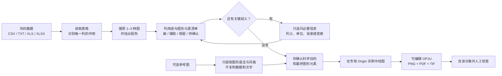

<div align="center">
  
  <h1>EditaPlot · 艾迪图</h1>
  <p><strong>AI 驱动的可编辑科研绘图工作流</strong><br>AI-guided editable scientific figures</p>
  <p>
    
    
    
    
    
    
    <a href="https://github.com/hang-jin/editaplot"></a>
  </p>
  <p><a href="README.en.md">English</a> · 中文为主要说明语言</p>
</div>

我把 EditaPlot 做成了一个面向 Codex 的 Windows 本地科研绘图 Skill。你把自己的实验数据交给它后，它会依次理解数据、逐列说明用途、推荐图形、请你确认图形元素、调用 Origin 并验证结果，最后生成**可编辑 OPJU**，同时导出 PNG、PDF、TIF。

我不希望它只是一套“替换数字”的静态模板，也不会让 Python 预览图冒充 Origin 成图。科学含义和最终选择始终由你决定；遇到把握不足的数据，EditaPlot 会把不确定的列单独列出来请你确认，不会擅自补列、拟合或推断结论。

> [!WARNING]
> **我目前只完成了 Windows 10/11 x64 实体电脑上的完整验证。** 因此 V1 暂未提供 macOS（Intel 与 Apple Silicon）、Linux、WSL、Wine/CrossOver、Parallels 或其他虚拟机版本。如果你使用 Mac，这一版暂时还不能完成 Origin 全流程；当前请换用 Windows 实体电脑，后续支持情况以 release 说明为准。

> [!IMPORTANT]
> 我已按 [Apache License 2.0](LICENSE) 开源 EditaPlot。当前兼容目标是 Origin/OriginPro 2021–2026b；你不必提前打开它，EditaPlot 会在绘图前自动启动一个专用实例。我不会替你安装或修改 Origin。

## 一眼看懂



当我说“已经画好”时，你会拿到可继续编辑的 Origin 项目和 PNG、PDF、TIF；我还会检查原始数据没有被改动、坐标轴和文字完整、每个文件都能正常打开。

## 先理解数据，再决定画什么

很多科研表格并不是“每个数字都要画”。我会先把**每一列**放进下面一种用途，并用大白话请你确认：

| 用途 | 在图中怎么处理 |
|---|---|
| 主要证据 | 作为实测点、主曲线、柱体等核心元素绘制 |
| 可见辅助 | 作为背景、拟合线、残差、参考线或物相刻线绘制 |
| 仅用于计算或验证 | 保留用于权重、筛选、坐标或布局，不画成曲线 |
| 保留但不绘制 | 留在数据映射和可编辑项目中，图上不显示 |
| 仍不确定 | 暂停规划，先问清楚用途，不能自动猜成新曲线 |

确认时你会看到“这是什么数据、哪些列会画、哪些列不会画、会出现哪些图形元素、哪些计算不会自动做”。只要源文件、列映射或理解结果发生变化，这次确认就会失效，需要重新核对。

### GSAS / GSAS-II XRD Rietveld 示例

我已为普通 XRD、GSAS-II Powder CSV 和 Publication CSV 加入专门的理解规则。以精修表为例，EditaPlot 可以把 Observed 识别为实测点、Calculated 识别为计算线，并按文件实际提供的内容加入 Background、Difference 和具备明确身份的 Phase 刻线；`weight`、`Q`、`Used`、`diff/sigma`、`Axis-limits` 等列会保留为辅助或控制数据，不会被误画成强度曲线。

Publication CSV 中已经带显示位置的 `Diff` 会按源值直接绘制，不会再次偏移。我也不会自动计算背景、差值、Rwp、χ²，或替你识别物相和峰归属。仓库内提供了 [`example_gsas_powder.csv`](runtime/templates/xrd/example_gsas_powder.csv) 与 [`example_gsas_publication.csv`](runtime/templates/xrd/example_gsas_publication.csv)，可以先拿它们熟悉格式。

### 用参考图告诉我“想要这种表达”

你也可以上传一张 PNG、JPEG 或 TIFF 参考图。我会先把它理解为“图形简报”：提取面板、插图、点线柱等图形元素、数据编码和有限的视觉风格，再把**适合当前模板且有用户数据支撑**的部分列出来请你单独确认。

这条路线不会从像素反推实验数据，不复制参考图中的数值、文字、拟合结果、物相、Logo 或水印，也不会把参考图片塞进 OPJU。它的目标是安全借鉴图形语法，而不是承诺任意图片 1:1 复刻；当前模板表达不了的关键元素会明确拒绝或保留模板默认值。

## Star 趋势

这是我从开源首日开始记录的 GitHub Star 总数。首个快照是一个真实的 31 Stars 起点；后续每日快照会自然连成折线。

<div align="center">
  <a href="https://github.com/hang-jin/editaplot"></a>
</div>

我只保存“日期 + 仓库 Star 总数”，不读取或保存用户名、账号 ID、个人加星时间或名单。

## 能力覆盖

| 领域 | 已覆盖图形与证据 |
|---|---|
| 材料与光谱 | XPS、普通 XRD、GSAS/GSAS-II XRD Rietveld、XAS、PL/TRPL、UV–Vis/Tauc、EIS、CV、LSV、三维多条件 Nyquist |
| 通用统计 | 柱状/条形、误差棒、堆叠/百分比堆叠、饼图、桑基、折线、趋势、散点、气泡、雷达、热力图 |
| 分布与效应 | 原始点汇总、箱线、小提琴、Raincloud、直方图、森林效应图 |
| 医学与深度学习 | ROC、PR、校准、DCA、混淆矩阵、Bland–Altman、配对纵向轨迹、分组箱线、预计算 SHAP、医学多面板规划 |

我不会擅自平滑数据、删除异常值、补峰、计算误差、拟合曲线、识别物相或训练模型。寿命、带隙、SHAP 等分析结果也只有在你明确提供后才会画进图里。

## 真实 Origin 示例

我用合成教学数据制作并人工检查了下面这些示例。公开图片已去除可能泄露信息的元数据，每个文件的校验值都记录在清单中。

<div align="center">
  
  
  
  
  
  
</div>

➡️ [浏览全部 37 个图形案例与简要用途](docs/gallery.md)

## 中文科研配色


我在首屏准备了 8 套推荐色组，完整目录另含 2 套进阶色组。你只需选择喜欢的配色，EditaPlot 会记住具体颜色和使用限制，让以后重画保持一致。对 XPS 组分、正负值、热力图、诊断参考线等有科学含义的颜色，我不会为了美观随意改变。

这些配色由我重新设计和抽象，不复制期刊封面、水印或版式，也不是任何期刊的官方模板。详见[配色指南](docs/palette-guide.md)。

## 开始使用

### 1. 准备环境

| 项目 | 你需要知道的事 |
|---|---|
| 系统 | 我目前完整验证的是 Windows 10/11 x64 实体电脑；Mac、Linux、WSL 与虚拟机版本暂未提供 |
| Origin | 兼容目标为 Origin/OriginPro 2021–2026b；2024b（10.15）是当前唯一完整实机基线，其他目标版本会按本机握手、真实测试和模板能力报告 |
| Python | 需要 64 位 Python 3.10–3.12；启动器会自动选择，你无需手动配置 |
| 数据 | 你可以使用 CSV、TXT、XLS 或 XLSX，也可以保留中文列名与中文路径 |

你不必先弄懂 Python 环境。我让根目录的 `editaplot.cmd` 先寻找电脑上已有的兼容 Python，再创建只属于本项目的环境。如果完全找不到，它会先用中文说明接下来会发生什么，并等待你同意后再通过官方 winget 安装用户范围的 Python 3.12；没有 winget 时会给出 python.org 官方安装指引。这个过程不会安装或修改 Origin。Doctor 只做只读发现；正式绘图前的真实 smoke 才会自动启动专用 Origin 实例并验证连接。

### 2. 安装 Codex Skill

```powershell
git clone https://github.com/hang-jin/editaplot.git
Set-Location editaplot
.\editaplot.cmd setup
```

请下载或克隆完整仓库，因为 `skill/editaplot` 和绘图 `runtime/` 需要一起工作。只复制 Skill 子目录会缺少绘图引擎。如果你不会使用 GitHub，也可以直接下载 Source ZIP，完整解压后在该目录运行同一条 `setup` 命令。详见[安装指南](docs/installation.md)。

重新打开一个 Codex 任务后使用 `$editaplot`。第一次处理数据，只需：

```powershell
.\editaplot.cmd start "$HOME\Documents\my-data.csv"
```

如果你是第一次使用，最简单的方法是把文件拖进 Codex，然后说：“请使用 `$editaplot` 帮我画这份数据。”我会让 EditaPlot 完成环境检查、只读识别与候选图推荐，再给出逐列用途和图形元素清单；你只需确认科学目的与这份清单，只有判断不够明确时才需要补充列义、误差或变换等关键细节。熟悉命令行后，也可以使用下面这些命令：

正式绘图时，我会让 EditaPlot 在原始数据旁边新建 `<数据文件名>_EditaPlot_<时间>` 文件夹，并把 render-plan、OPJU、PNG、PDF、TIF、反读与验证结果集中放进去。它不会覆盖原始数据；只有你明确指定其他位置时，才会改变输出目录。

```powershell
.\editaplot.cmd doctor
.\editaplot.cmd inspect <data.csv>
.\editaplot.cmd recommend <data.csv> --intent "比较模型并展示误差"
.\editaplot.cmd understand <data.csv> --template-id xrd --output data-understanding.json
.\editaplot.cmd palettes
.\editaplot.cmd plan <data.csv> --template-id bar --claim "模型 A 指标更高" --evidence-role comparison --palette-id ocean_coral --semantic-confirmation-json semantic-confirmation.json --output render-plan.json
.\editaplot.cmd render render-plan.json
.\editaplot.cmd verify <Origin-output-directory>
```

仓库已经包含运行所需的 `runtime/`。日常使用可以忽略 `--engine-home`；只有你主动替换内置引擎时才需要它。

### 3. 直接复制给 Codex 的提示词

```text
请使用 $editaplot 帮我画这份数据。不要修改原文件；先告诉我识别到哪些列、最推荐哪种图，
再逐列说明哪些要画、哪些只作辅助或验证、哪些保留但不画，并列出最终图形元素和不会自动进行的
计算。若有不确定列，请先问我，不要猜。若需要安装 Python，请先征得我同意；不要安装或修改 Origin。
等我确认科学目的和元素清单后再绘图，完成后请检查可编辑项目和 PNG、PDF、TIF。
我不需要提前打开 Origin。Doctor 只做只读发现；请在绘图前运行真实 smoke，
自动启动专用 Origin 实例并按当前版本和模板能力继续。
```

如果还提供了参考图，可以接着说：

```text
请把参考图只当作视觉简报：总结它的图形元素、布局、数据编码和可安全采用的风格，
不要复制图中的数据、文字、拟合结果、物相、Logo 或水印，也不要把参考图嵌入成图。
请分别列出“采用、保留模板默认、拒绝、仍需确认”的内容，等我确认后再适配到我的数据。
```

需要正式绘图时：

```text
请按已确认的 RenderPlan 自动启动专用 Origin 实例并绘制，成功后保留可编辑 Origin 窗口；
若 smoke 或绘图失败，只简要报告技术阶段和下一步。导出 OPJU、PNG、PDF、TIF，并完成轴、
字体、图层、数据映射反读和人工视觉检查。不要只看 PNG 报成功。
```

## 公开仓库里有什么，哪些内容留在本地

我把公开仓库整理成了一套完整可运行的软件。为了不把你的数据和我的开发记录混进公开版本，我只在本地保留发布时不应携带的证据；这里没有隐藏功能或“付费完整版”。

| 我放进公开仓库的内容 | 我只保留在本地的内容 |
|---|---|
| Apache-2.0 源码、完整 Skill、清理后的 runtime | `DEVELOPMENT_LEDGER.md`、内部计划与开发日志 |
| 中性合成示例数据、原创配色资产 | 你的原始数据、参考截图、未获再分发许可的材料 |
| 37 个已复核且清理元数据的 PNG | OPJU/PDF/TIF、RenderPlan、对象反读与验证 JSON |
| 双语文档、测试、依赖锁、资产与 runtime 校验清单 | 本机绝对路径、缓存、虚拟环境、临时输出、私钥与 token |

为了避免把本机资料误发到公开仓库，我给公开文件加了白名单、密钥扫描、PNG 检查和 SHA-256 清单。你可以在[发布与许可边界](docs/release-boundaries.md)查看完整规则。

## 我为科学可靠性保留的边界

- 我只读原始文件；绘图所需的辅助列只进入内存或可编辑 Origin 工作簿。
- 我会在绘图计划前逐列说明用途；不确定的数值列不会自动变成一条新曲线。
- 缺少列时，我会告诉你怎样修复，不会补造不存在的测量值。
- 参考图只能影响已确认数据可以支撑的图形语法与安全风格，不能新增证据或隐藏必需元素。
- 我只在第三轴具有真实实验含义且能改善证据表达时使用 3D，不做装饰性 3D。
- 图例可以在 OPJU 中手动移动；坐标轴缺失、字体不一致、色条重叠或文字裁切仍会判为失败。
- 新 Origin API 会先查官方文档并做隔离实验，未经验证的 LabTalk 参数不会进入正式模板。

## 独立项目声明

我独立维护 EditaPlot，只调用你电脑上已经安装的 Origin 或 OriginPro；默认启动由 EditaPlot 独占的本机实例，不要求你预先打开窗口。它不捆绑、安装或修改该应用，也不通过网络或云端开放其 Automation Server。我与 OriginLab Corporation 没有隶属、赞助或背书关系；相关名称仅用于说明兼容性。

## 开源、贡献与支持

顶部徽章和趋势图都只使用 GitHub 提供的仓库聚合数量。我不会请求、保存或展示 Star 用户名单、用户名、账号 ID 或个人加星时间。

- 许可证：[Apache License 2.0](LICENSE)
- 安装与故障处理：[安装指南](docs/installation.md)
- Origin 版本边界：[2021–2026b 兼容说明](docs/origin-2021-2026-compatibility.md)
- 中文快速开始：[docs/quickstart.zh-CN.md](docs/quickstart.zh-CN.md)
- 贡献说明：[CONTRIBUTING.md](CONTRIBUTING.md)
- 安全报告：[SECURITY.md](SECURITY.md)
- 支持范围：[SUPPORT.md](SUPPORT.md)
- 依赖与许可证清单：[docs/dependency-inventory.md](docs/dependency-inventory.md)

未来我可能会另行提供咨询、安装协助、定制或支持服务，但不会因此限制 Apache-2.0 已授予的权利。如果产品以后进入收费软件许可、托管/远程服务或多租户运行阶段，我会重新完成许可与商标审计后再发布。
