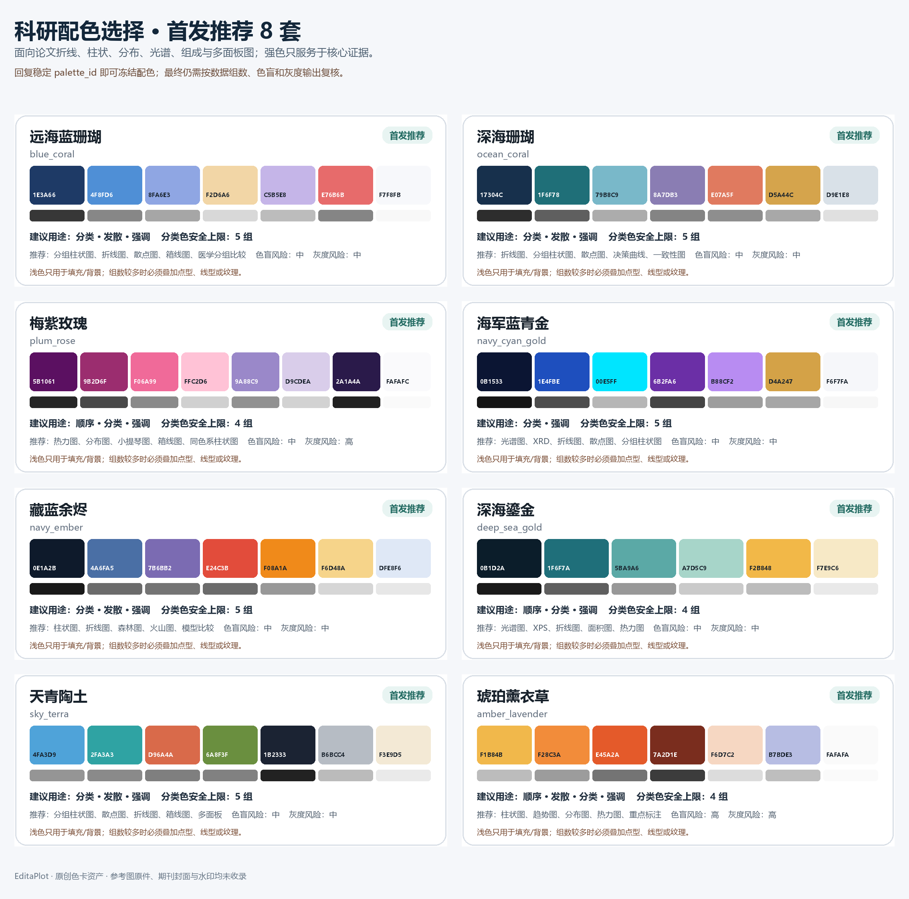

# 科研配色指南

配色目录由 10 个稳定 ID 和精确 HEX 组成。原始参考 JPG 含期刊封面与短视频水印，未进入 Skill、
展示站或 GitHub；产品只保留重新命名、重新绘制且机器可验证的色值和使用约束。

完整目录见 `assets/palettes/palette-selector-all.zh-CN.png` 与
`assets/palettes/palette-catalog.json`。

## 选择顺序

1. 先判断证据语义：分类、顺序、发散还是单一强调。
2. 再看实际组数是否超过 `max_qualitative_categories`。
3. 检查 CVD 与灰度风险；中高风险时必须使用点型、线型、纹理或直接标签。
4. 浅色只作填充/背景，正文和轴使用 `neutral_text`。
5. 计划中冻结 ID 和 HEX；同条件在相关图中保持同色。
6. 由 Origin/OriginPro 生成的输出同时检查彩色、灰度和图例语义。

## 不允许覆盖的语义色

XPS component、正负效应、连续热力图、诊断参考线、混淆矩阵等路线的颜色携带数据含义，不能
作为普通 cosmetic palette 替换。若用户明确要求新色，必须为该路线单独验证并登记，而不是
绕过 `palette_override_unsupported`。
